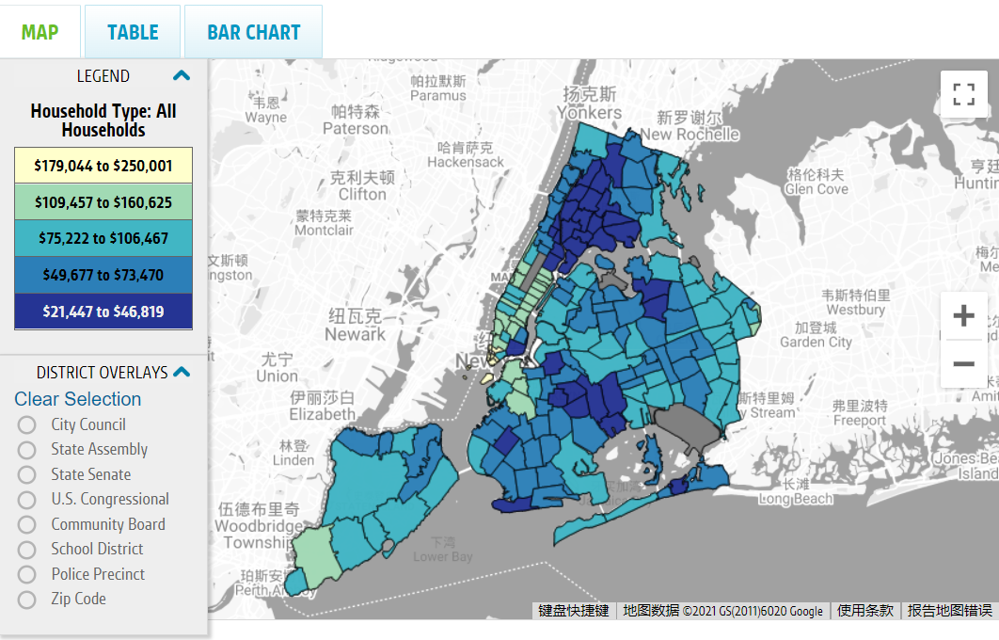

# Introduction

There are hundreds of shooting incidents in New York city on a yearly basis. Despite the statistics of crime events have been declining since 1990 in New York, in the number of shooting incidents was nearly double in 2020 compared to the year before. Even under the circumstances of COVID-19 pandemic, shooting incidents are still happening by a great number. This project explores the following questions: Are these shooting incidents have spatial and temporal connections? Do they happen in particular regions and time periods? What do the spatiotemporal interaction of these events suggests? And why are they clustered spatially and temporally? What could be done given this spatiotemporal interaction? Some basic hypotheses are: There is spatiotemporal interaction among a part of shooting incidents that happen in New York city every year and they could be explained by socioeconomic factors. The spatiotemporal interaction is tested with a statistical method called Knox statistic test. The correlation of spatiotemporal clusters of shooting incidents and socioeconomic variables are calculated to find causalities. As for results and conclusions, there is spatiotemporal interaction among NYC shooting incidents, and these spatiotemporal clusters have causality relationship with socioeconomic environments. 

Key words: Shooting incident, NYC, spatiotemporal interaction, Knox test, socioeconomic factors

# Materials and methods

This project employs two datasets, the zip code shapefile of New York city and the 2021 shooting incident data of New York city. Both datasets were downloaded from New York city open data(https://opendata.cityofnewyork.us/). The zip code shapefile contains 263 features identifying different zip codes in New York city. Each feature is tagged with the county name that they belong to. The shooting incident data is in CSV format, it contains the longitude and latitude coordinate of each incident. With these geographic coordinates, it is possible to convert the data frame generated directly from reading CSV file to a Spatial Point Data Frame. After projection, the distance matrix of the incidents could be calculated. These provides conditions to perform Knox statistical test with an R package called surveillance. The R package named surveillance is specialized in temporal and spatio-temporal modeling and monitoring of epidemic phenomena. With Knox test conclude with rejecting null hypothesis of no spatiotemporal interaction, visualization of the count of clustered incidents in each zip code could be produced. Finally, the choropleth map of count of clustered incidents will be compared to a map of median income map by zip codes of New York city. Though the two maps have some differences in partition of the city by zip code, they are basically similar to each other. 

```{r, message=F, warning=F}
library(lubridate)
library(sp)
library(surveillance)
library(mapproj)
library(sf)
library(mapview)
library(GISTools)
library(rgdal)
library(tidyverse)
library(rgeos)
library(lpSolveAPI)
library(dplyr)
library(tbart)
```

## Data cleaning and first figure
```{r}
# Read data
data_y2d <- read.csv("data/NYPD_Shooting_Incident_Data__Year_To_Date_.csv")
zipcode <- as(st_read("data/ZIP_CODE_040114/ZIP_CODE_040114.shp"), "Spatial")
# Visualize original data
coordinates(data_y2d) <- ~ Longitude + Latitude
proj4string(data_y2d) <- CRS("+init=epsg:4326")
coords <- data.frame(spTransform(data_y2d, CRS("+init=epsg:2263")))
# data_y2d is a spatial data frame now, visualizing the original datasets is possible
mapview(data_y2d, xcol = "Longitude", ycol = "Latitude", crs = "+init=epsg:2263") +
  mapview(zipcode)
```

```{r}
# Knox test
date <- as.Date(data_y2d$OCCUR_DATE, format = "%m/%d/%y")
startdate <- as.Date("01/01/2021", "%d/%m/%y")
date_number <- difftime(date, startdate, units = "days")
date_numeric <- as.data.frame(as.numeric(date_number))
dt_mat <- dist(date_numeric, diag = TRUE, upper = FALSE)
coords_lonlat <- data.frame(coords$Longitude, coords$Latitude)
dist_mat <- dist(coords_lonlat, method = "euclidean", diag = TRUE, upper = FALSE)
k_test <- knox(dt = dt_mat, ds = dist_mat, eps.t = 3, eps.s = 10)
# Plot k_test result
# plot(k_test)
```

```{r}
# Visualize spatiotemporal clusters
c1 <- which(dist_mat <= 10)
c2 <- which(dt_mat <= 3)
c <- intersect(c1, c2)

index_cluster <- c(1:902)
index_cluster <- index_cluster - index_cluster

i <- 0

for (n in 2:902){
  for (m in 1:(n-1)){
    i <- i + 1;
    if (i %in% c){
      index_cluster[n] <- 1;
      index_cluster[m] <- 1;
    }
  }
}

data_y2d$CLUSTERED <- index_cluster

# mapView(data_y2d, xcol = "Longitude", ycol = "Latitude", zcol = "CLUSTERED", crs = "+init=epsg:2263") + 
#   mapview(zipcode)
```

```{r}
# Generate statistics of spatiotemporal clusters
names(data_y2d)[1] <- "INCIDENT_KEY"
data_y2d_transform <- spTransform(data_y2d, zipcode@proj4string)
data_y2d_transform <- st_as_sf(data_y2d_transform)
clustered_incidents <- data_y2d_transform %>% filter(CLUSTERED == 1)
clustered_incidents <- as(clustered_incidents, "Spatial")
clustered_incidents <- spTransform(clustered_incidents, zipcode@proj4string)
overlay <- clustered_incidents %over% zipcode
zipcode$COUNT <- c(1:nrow(zipcode))
zipcode$COUNT <- zipcode$COUNT - zipcode$COUNT
for (i in c(1:nrow(zipcode))){
  zipcode$COUNT[i] <- length(which(overlay == zipcode$ZIPCODE[i]))
}
# mapview(zipcode, zcol = "COUNT")
```

Add any additional processing steps here.

# Results

The Knox test in this project uses 10km as spatial thresholds and 3 days as temporal thresholds to define spatiotemporal cluster. The following are results of the Knox statistical test and visualized probability distribution function compared with observed value. 

```{r}
k_test
plot(k_test)
```

The statistical report suggests that there are 335 pairs of shooting incidents are clustered both spatially and temporally. The observed value leads to p-value of 0.001. This project choose the rule of thumb of p-value threshold to reject null hypothesis of 0.05. Therefore null hypothesis is rejected, there is spatiotemporal aggregation in New York shooting incidents in 2021. 

The following two graphs shows the clustered incidents (1) against non clustered incidents (0) and choropleth map of count of clustered incidents by zip code. These two graphs suggests that despite there are many incidents are spatially aggregated, they are not temporally aggregated. 

```{r}
mapView(data_y2d, xcol = "Longitude", ycol = "Latitude", zcol = "CLUSTERED", crs = "+init=epsg:2263") + 
  mapview(zipcode)
```

```{r}
mapview(zipcode, zcol = "COUNT")
```
Finally, compare the choropleth map of count of incidents by zip code with the following map of median income by zip code. It is evident that where median income has the lowest level, the count of clustered incidents are more than other zip codes. Such correlation lead to connection between shooting incidents and income level. 



# Conclusions
The crimes in New York city, no matter increase or decrease by time, keeps at a level that maintains the level of tension which keeps households and people living in the city indoor after a certain time late in the night. As for the causes of these crime incidents, to which alcohol assumption and deterrence are both related, with deterrence effects stronger than alcohol effects in general[1]. Shooting incidents in New York city have a long history, 2.85 percent of all the serious crime in New York city was committed with the aid of firearms in 1966[2]. To identify repeat and near-repeat patterns of crime in time and space, spatial-temporal interaction analysis is usually employed[3]. 
In this project the spatiotemporal interaction analysis is performed with Knox statistics[4]. And allocation of police stations is resolved with Maximal Coverage Location Problem(MCLP)[5]. MCLP algorithm is chosen because the city simply may not be able to afford building and maintaining the number of facilities needed for complete coverage[6]. 
The direct conclusion is that the shooting incidents in New York city of 2021 are have spatiotemporal aggregation and this aggregation is correlated to median income level. 
In this session, a proposal of a project that put the spatiotemporal cluster analysis in application is made as follows. Use weighted overlay method to combine the spatiotemporal cluster count layer of all major crimes in the New York city to generate the weights of candidate sites formulated in MCLP objective function. 

# References
[1]  Alcohol Consumption, Deterrence and Crime in New York City. (2013). National Bureau of Economic Research.
[2]  Does Firearms Registration Work: A Statistical Analysis of New York State and New York City Crime Data. (1968).
[3]   Zhang, Zhao, J., Ren, L., & Hoover, L. (2015). Space-time clustering of crime events and neighborhood characteristics in Houston. Criminal Justice Review (Atlanta, Ga.), 40(3), 340–360. https://doi.org/10.1177/0734016815573309
[4]  Knox. (1964). The Detection of Space-Time Interactions. Journal of the Royal Statistical Society. Series C (Applied Statistics), 13(1), 25–30. https://doi.org/10.2307/2985220
[5]  Church, R., ReVelle, C. The maximal covering location problem. Papers of the Regional Science Association 32, 101–118 (1974). https://doi.org/10.1007/BF01942293
[6]  Church, & Murray, A. T. (2009). Business site selection, location analysis, and GIS . John Wiley & Sons.